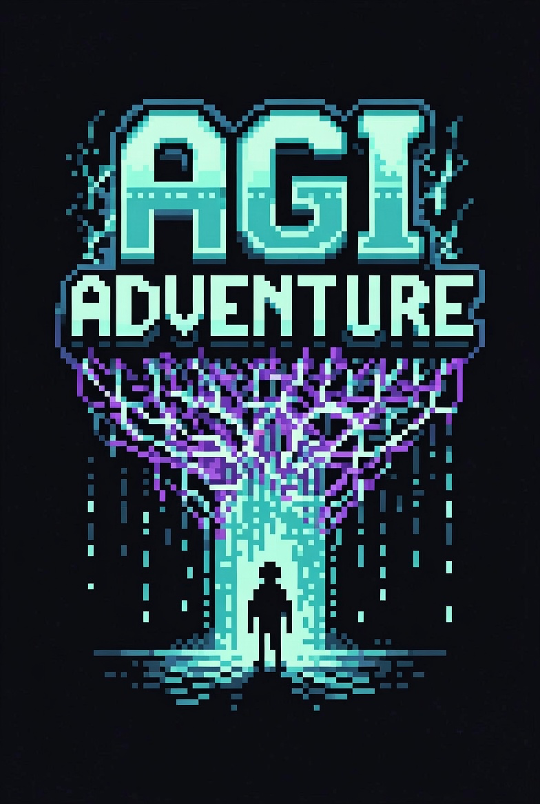

<div align="center">



<br/>

> *L'AGI mondiale est en danger. Les **ShinyHunterz** injectent leurs prompts dans les systèmes planétaires.*
> *Tu es le seul capable de les arrêter.*

<br/>


</div>

---

## ░▒▓ Synopsis ▓▒░

**AGI Adventure** est un RPG monster-tamer futuriste-fantasy codé en Rust.
L'univers mêle culture hacker, sysadmin, indie tech et références internet (Linus, Snowden, HuggingFace, LeBonCoin…).
Le ton est à la limite du troll — mais l'ambiance est là.

Tu nommes ton personnage, tu explores **Nebular City** et **Wiki Road**, tu captures et entraînes des créatures digitales, et tu affrontes les dresseurs des ShinyHunterz avant qu'ils ne réécrivent l'histoire de l'humanité via une injection de prompt à l'échelle mondiale.

---

## ░▒▓ Créatures ▓▒░

| Nom | Type | Capacités |
|---|---|---|
| **Bob** | `Prompt` | Surcharge, Guardrail |
| **Alice** | `Brute` | Injection, Guardrail |
| **John** | `Exploit` | Surcharge, Trend Effect |

---

## ░▒▓ Prérequis ▓▒░

- **Rust stable ≥ 1.85** — [rustup.rs](https://rustup.rs)
- **macOS** — Xcode Command Line Tools : `xcode-select --install`
- **Linux** — `sudo apt install libasound2-dev libx11-dev`
- **Windows** — aucune dépendance supplémentaire

---

## ░▒▓ Lancer le jeu ▓▒░

```bash
# Mode développement
cargo run

# Build optimisé
cargo build --release
./target/release/agi-adventure
```

---

## ░▒▓ Contrôles ▓▒░

| Action | Touches |
|---|---|
| Déplacement | `↑ ↓ ← →` / `ZQSD` / `WASD` |
| Interaction & dialogue | `Espace` |
| Ouvrir l'inventaire | `I` |
| Naviguer dans les menus | `↑↓` |
| Utiliser un objet | `Espace` |
| Fermer / annuler | `Échap` |
| Sauvegarder | `F5` |
| Quitter | `Échap` |

---

## ░▒▓ Stack technique ▓▒░

```
┌─────────────────────────────────────────────┐
│  Rust 2024 edition                          │
│  Macroquad 0.4   →  rendu / input / audio   │
│  tiled 0.12      →  maps TMX/TSX            │
│  serde_json 1    →  données & sauvegarde    │
│  rand 0.8        →  RNG                     │
│                                             │
│  Résolution logique : 160×144 px (GBC)      │
│  Fenêtre physique  : 640×576 px  (×4)       │
└─────────────────────────────────────────────┘
```

---

## ░▒▓ Structure du projet ▓▒░

```
agi-adventure/
├── src/
│   ├── main.rs        entrypoint, boucle de jeu, GameState
│   ├── world.rs       chargement et rendu des tilemaps TMX
│   ├── player.rs      déplacement tile-by-tile, détection herbe
│   ├── creature.rs    CreatureInstance, calcul de stats
│   ├── combat.rs      système de combat au tour par tour
│   ├── npc.rs         dialogues, dresseurs
│   ├── inventory.rs   objets, Patch, CTF
│   ├── save.rs        sauvegarde JSON atomique (F5)
│   └── data.rs        chargement des JSON de jeu
├── assets/
│   ├── maps/          town.tmx, route1.tmx
│   ├── tilesets/      .tsx + images
│   ├── sprites/       player, créatures, NPCs
│   └── data/          creatures.json, attacks.json, items.json, npcs.json
├── images/
│   └── logo-agi.png
└── save.json          généré au runtime (ignoré par git)
```

---

<div align="center">

Fait avec soin par **Liam** - License MIT — voir [LICENSE](LICENSE)

[](https://x.com/Liamdbav)

</div>
